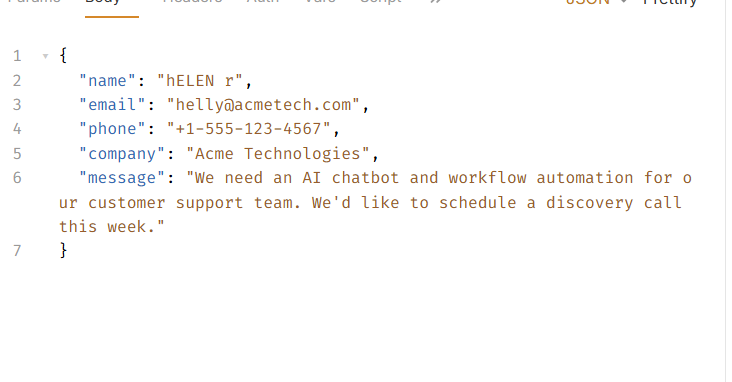
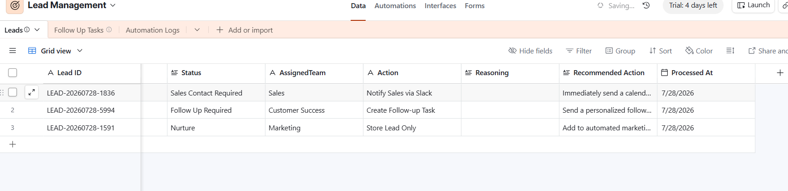
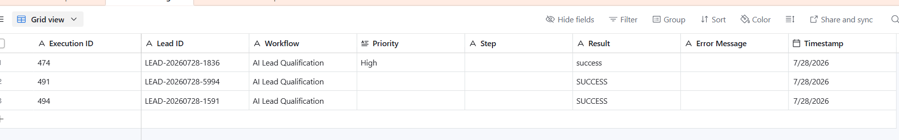

# 🤖 AI Lead Qualification System

Businesses often receive dozens of inbound leads every day.

Manually reviewing every lead is slow, inconsistent, and causes high-value prospects to wait too long.

This workflow automatically validates, qualifies, prioritizes, routes, and logs every inbound lead using AI.

An intelligent lead qualification workflow built with **n8n**, **Google Gemini AI**, **Airtable**, and **Slack**.

The workflow automatically validates incoming leads, eliminates duplicates, scores lead quality using AI, assigns priorities, routes leads to the appropriate team, and logs every execution for monitoring and auditing.

---

## 🚀 Features

- ✅ Webhook API for lead submission
- ✅ Input validation and data cleaning
- ✅ Duplicate lead detection
- ✅ Automatic Lead ID generation
- ✅ AI-powered lead qualification using Google Gemini
- ✅ Structured JSON AI response parsing
- ✅ Lead enrichment (Status, Action, Assigned Team)
- ✅ Airtable CRM integration
- ✅ Priority-based workflow routing
- ✅ Slack notifications for high-priority leads
- ✅ Follow-up task creation for medium-priority leads
- ✅ Automation execution logging
- ✅ Retry mechanism for external services
- ✅ Professional workflow architecture

---

# 🏗 Workflow Architecture

```
Incoming Lead
      │
      ▼
Webhook
      │
      ▼
Validate Required Fields
      │
      ▼
Clean & Normalize Data
      │
      ▼
Duplicate Lead Check
      │
      ├──────── Duplicate
      │             │
      │             ▼
      │      Update Existing Record
      │             │
      │             ▼
      │       Return Response
      │
      ▼
Generate Lead ID
      │
      ▼
Gemini AI Qualification
      │
      ▼
Parse AI JSON
      │
      ▼
Enrich Lead Data
(Status, Action, Assigned Team)
      │
      ▼
Save Lead to Airtable
      │
      ▼
Route by Priority
      │
      ├──────── High
      │            │
      │            ▼
      │      Slack Notification
      │
      ├──────── Medium
      │            │
      │            ▼
      │      Create Follow-up Task
      │
      └──────── Low
                   │
                   ▼
             Store Lead
                   │
                   ▼
          Log Automation
                   │
                   ▼
        Respond to Webhook
```

---

# 🧠 AI Output

Gemini returns structured JSON:

```json
{
  "score": 92,
  "priority": "High",
  "reasoning": "Lead demonstrates strong buying intent with clear business requirements.",
  "recommended_action": "Schedule a discovery call within 24 hours."
}
```

---

# 📊 Lead Enrichment

Each lead is enriched with additional metadata before being stored.

| Field | Description |
|--------|-------------|
| AI Score | AI qualification score |
| Priority | High / Medium / Low |
| Status | Business workflow status |
| Action | Next automation step |
| Assigned Team | Sales / Customer Success / Marketing |
| Processed At | Processing timestamp |

---

# 📂 Airtable Structure

## Leads

| Field |
|--------|
| Lead ID |
| Name |
| Email |
| Phone |
| Company |
| Message |
| AI Score |
| Priority |
| Status |
| Assigned Team |
| Action |
| Reasoning |
| Recommended Action |
| Processed At |

---

## Follow-up Tasks

| Field |
|--------|
| Lead ID |
| Lead Name |
| Email |
| Priority |
| Assigned Team |
| Task |
| Due Date |
| Status |

---

## Automation Logs

| Field |
|--------|
| Execution ID |
| Workflow |
| Lead ID |
| Failed Node |
| Priority |
| Result |
| Error Message |
| Timestamp |

---

# 🔀 Lead Routing

| Priority | Action | Assigned Team |
|----------|--------|---------------|
| 🔴 High | Notify Sales via Slack | Sales |
| 🟡 Medium | Create Follow-up Task | Customer Success |
| 🟢 Low | Store Lead | Marketing |

---

# 🛠 Technology Stack

- **n8n**
- **Google Gemini AI**
- **Airtable**
- **Slack**
- **REST Webhooks**

---

# 🛡 Error Handling

The workflow includes production-inspired reliability features:

- Retry failed API requests
- Duplicate lead detection
- AI response validation
- JSON parsing validation
- Automation execution logging
- Structured webhook responses

---

# 📸 Screenshots

## Workflow


---
## Bruno POST Request



## Airtable Leads

!

---

## Slack Notification


---

## Automation Logs




---

# 🎥 Demo

Adding Soon!

---

# 📁 Repository Structure

```
ai-lead-qualification-system/
│
├── README.md
├── workflow.json
├── docs/
│   ├── workflow.png
│   ├── airtable-leads.png
│   ├── slack-alert.png
│   ├── automation-logs.png
│   └── architecture.png
│
└── demo/
    └── demo.mp4
```

---

# 👨‍💻 Author

**Ayman Amjad**

AI Automation Developer

Specializing in intelligent business workflow automation using **n8n**, **LLMs**, and modern automation tools.

---

⭐ If you found this project interesting, feel free to star the repository.
