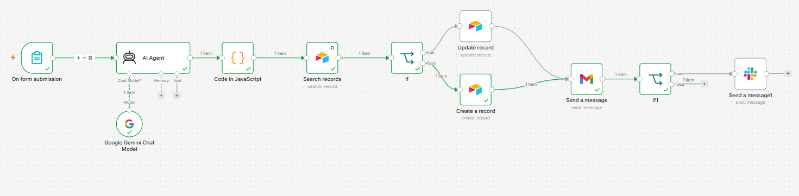
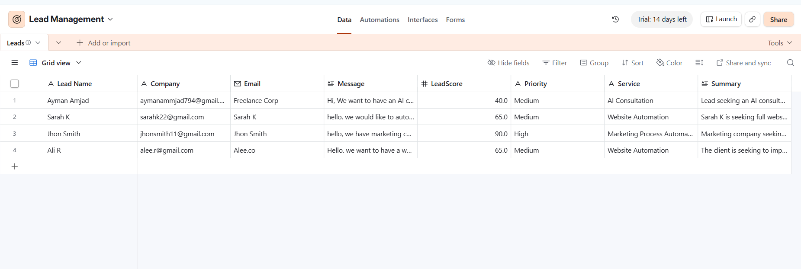
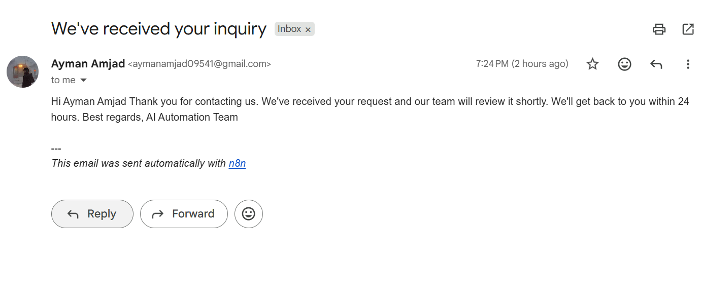
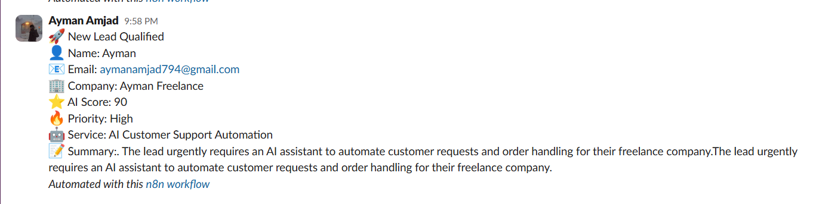

# 🤖 AI Lead Qualification System

An AI-powered lead qualification workflow built with **n8n**, **Google Gemini**, **Airtable**, **Gmail**, and **Slack**. This automation analyzes incoming leads, scores them using AI, stores them in a CRM, prevents duplicate entries, sends confirmation emails, and alerts the sales team about high-priority opportunities.

---

## 🚀 Features

- 🤖 AI-powered lead scoring using Google Gemini
- 📊 Automatic lead qualification (High, Medium, Low)
- 📝 AI-generated lead summary
- 💼 AI-recommended service based on inquiry
- 🔍 Duplicate lead detection using Airtable
- 🗄️ Automatic record creation or update
- 📧 Customer confirmation email
- 💬 Slack notifications for high-priority leads
- ⚡ Fully automated workflow built in n8n

---

## 🏗 Workflow Overview

1. Customer submits a lead form.
2. Google Gemini analyzes the inquiry.
3. AI generates:
   - Lead Score
   - Priority
   - Recommended Service
   - Lead Summary
4. Airtable is searched for existing leads.
5. Existing records are updated or new records are created.
6. A confirmation email is sent to the customer.
7. High-priority leads trigger a Slack notification.

---

## 🛠 Tech Stack

| Tool | Purpose |
|------|----------|
| n8n | Workflow Automation |
| Google Gemini | AI Lead Analysis |
| Airtable | CRM Database |
| Gmail | Customer Email |
| Slack | Team Notifications |

---

## 📈 Business Value

This workflow helps businesses:

- Reduce manual lead qualification
- Respond to customers faster
- Prioritize high-value opportunities
- Prevent duplicate CRM records
- Improve sales team productivity
- Automate repetitive tasks

---

## 📸 Screenshots

### Workflow



### Airtable CRM



### Confirmation Email



### Slack Notification



---

## 📂 Project Structure

```text
ai-lead-qualification-system/
│
├── workflow/
│   └── ai-lead-qualification-system.json
│
├── screenshots/
│   ├── workflow.png
│   ├── airtable.png
│   ├── email.png
│   └── slack.png
│
├── docs/
│   └── architecture.md
│
├── README.md
└── LICENSE
```

---

## ⚙️ How to Use

1. Import the workflow JSON into n8n.
2. Connect your credentials for:
   - Google Gemini
   - Airtable
   - Gmail
   - Slack
3. Configure your Airtable base and Gmail account.
4. Activate the workflow.

---

## 📄 License

This project is licensed under the MIT License.
